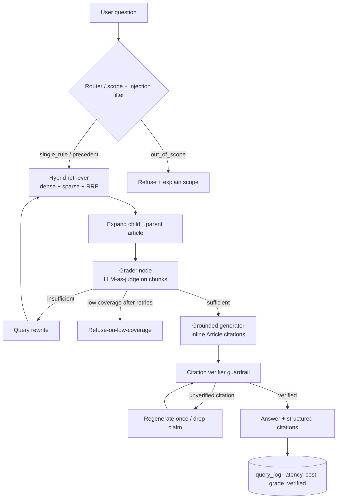

# F1 Rule & Penalty Interpreter

An **agentic RAG** system that explains *why* Formula 1 penalties were given and what the FIA
Sporting Regulations actually say — grounded in **1,000+ FIA regulation and steward-decision PDFs**,
with **verified citations**. Ask a question in plain English; get a rule-grounded answer with
clickable article citations, a confidence-gated refusal when the corpus doesn't cover it, and
per-query cost/latency tracking.

> Built for F1 fans who find steward decisions and the regulations impenetrable. See
> [`docs/PROPOSAL.md`](docs/PROPOSAL.md) for the original problem statement and
> [`legacy/AI_Engineering_Project.ipynb`](legacy/AI_Engineering_Project.ipynb) for the v1 Colab
> prototype this replaces. The FIA PDF corpus lives in [`data/`](data/).

## What it does

- **Hybrid retrieval** over Postgres + `pgvector` (dense embeddings + sparse full-text, fused with
  Reciprocal Rank Fusion) across the 2026 Sporting Regulations, the 2025 penalty-points table, and
  ~1,360 steward decision documents.
- **LangGraph corrective-RAG agent**: `router → retrieve → grade → (rewrite) → generate → verify`.
  An LLM-as-judge **grades retrieval sufficiency in the loop** and rewrites the query if it's weak.
- **Guardrails** mapped to real risks: a **citation verifier** (every cited article must appear in
  the retrieved sources, or it's dropped/flagged), **refuse-on-low-coverage** (won't guess when the
  corpus doesn't cover the question), and **scope + prompt-injection** filtering at the router.
- **FastAPI** service with **SSE streaming**, a minimal web UI with clickable citation chips, and an
  **observability dashboard** (p50/p95 latency, cost/query, refusal rate, grade distribution).
- An **evaluation harness** with a hand-seeded golden set and an **ablation grid** that produces the
  real citation-coverage-vs-config curve, plus a **CI eval gate**.

## Architecture



**Stack:** FastAPI · LangGraph · Postgres/pgvector · OpenAI (`gpt-4o-mini` + `text-embedding-3-small`)
· Docker Compose · GitHub Actions. Code is organized under `api/app/` (ingestion, retrieval, agent,
guardrails, llm, routes), `eval/`, and `web/`.

## Quickstart

Requires Docker + Docker Compose. Put your key in `.env` (`OPENAI_KEY=sk-...`; see `.env.example`).

```bash
make up                     # build + start db (pgvector) + api + web
make migrate                # apply DB migrations (idempotent)
make ingest                 # parse + embed the full corpus into pgvector (~$0.003, a few minutes)
```

Then:

- Web UI: <http://localhost:3000>
- API docs (Swagger): <http://localhost:8000/docs>
- Dashboard: <http://localhost:8000/dashboard>

```bash
curl -s -X POST localhost:8000/ask -H 'Content-Type: application/json' \
  -d '{"question":"What is the penalty for an unsafe release in the pit lane?","stream":false}'
```

Make targets: `make up | down | migrate | ingest | ingest-sample | scrape | update | eval | eval-smoke | test | lint | psql`.

### Keeping it current (auto-update after each race)

After a race weekend, pull that race's decision documents and add them to the knowledge base with a
single command:

```bash
make update GP=qatar              # SEASON defaults to 2025
```

This scrapes the chosen Grand Prix's decision PDFs into `data/decision_docs/<season>_<gp>/` (using the
official Playwright Docker image, so no host dependencies), then ingests **just that race** into
pgvector. It takes a couple of minutes and costs a fraction of a cent — the full-corpus run is only
needed once. Ingestion is incremental and idempotent: unchanged files are skipped by content hash,
and steward decisions are keyed on `(season, grand_prix, document_number)`, so a re-issued/corrected
document (FIA "V2" revisions) updates the existing entry instead of duplicating it. New chunks are
searchable immediately — pgvector's HNSW index updates on insert, no API restart or reindex needed.

> New seasons: the scraper defaults to the 2025 championship page; pass `--page-url` (see
> `scripts/get_decision_docs.py --help`) for other seasons.

## Deployment

The stack is a single `docker compose` project, so hosting it is "clone + one secret +
two commands" on any Ubuntu VM. [`docs/DEPLOY.md`](docs/DEPLOY.md) walks through a
**DigitalOcean droplet** (free for ~a year via the GitHub Student Pack's $200 credit):

```bash
make prod-up        # db + api + web (web on :80), hardened compose
make prod-migrate
make prod-ingest
```

`docker-compose.prod.yml` hardens for public exposure: Postgres + the API are not
published to the internet (only nginx on port 80 is), `/ask` is rate-limited per IP, and
a `DAILY_REQUEST_CAP` puts a hard ceiling on OpenAI spend.

## Evaluation

Metrics are **hand-written** in `eval/metrics.py` (recall/precision/nDCG@k, citation coverage,
citation correctness, refusal correctness); Ragas (faithfulness / answer-relevancy / context-
precision) is optional via `--ragas`. The golden set (`eval/golden.jsonl`) is **seeded
semi-automatically** from real steward decisions (their own cited articles become the ground truth)
plus curated regulation/penalty questions; `eval/unanswerable.jsonl` drives refusal testing.

```bash
make eval                                  # full golden set
make eval-smoke                            # fast deterministic-ish subset
docker compose run --rm api python -m eval.ablation --subset smoke   # ablation grid + chart
```

**Baseline (full golden set, hybrid retrieval, top-k=5, `gpt-4o-mini`):**

| recall@5 | precision@5 | nDCG@5 | citation coverage | citation correctness | refusal correctness | cost/query |
|---|---|---|---|---|---|---|
| 0.37 | 0.31 | 0.41 | 0.36 | 0.58 | 0.91 | ~$0.0004 |

**Ablation (retrieval mode × top-k).** Increasing top-k lifts both recall and citation coverage;
`hybrid/k=10` is the best-balanced config (coverage **0.67**, recall **0.67**). A key finding:
**sparse-only retrieval posts a misleadingly high coverage (1.0) at terrible recall (0.13)** — it
only answers the questions it can ground and refuses the rest, which is exactly why coverage must be
read alongside recall. Full table + chart in [`eval/results/summary.md`](eval/results/summary.md)
and `eval/results/ablation.svg`.

## CI

`.github/workflows/ci.yml` runs `ruff` + `pytest` (fully offline, LLM + DB mocked) on every PR. When
an `OPENAI_KEY` secret is configured, a second job spins up a `pgvector` service, ingests a smoke
corpus, and runs the eval harness with a **citation-coverage regression gate** (`--gate
citation_coverage:0.15`) that fails the build on regression.

## Known limitations

- **Regulation-version mismatch.** The only full Sporting-Regs text in the corpus is the **2026
  Section B** (articles numbered `B1.4.2`), but the **2025 steward decisions cite the prior
  numbering** (`33.3`, `55.15`). The citation verifier normalizes across both schemes and also treats
  a decision as ground truth for the article it itself cites, but some rule citations therefore
  resolve against the decision rather than the regulations.
- **Appendix-only citations.** Many driving incidents (collisions) are governed by *Appendix L* of
  the International Sporting Code, which has no dotted sporting-regulation article — those answers are
  correctly grounded in the decision's reasoning but score lower on article-based citation metrics.
- **Penalty-table parsing** flattens a multi-column PDF table heuristically; article ids are reliable
  but offence/sanction text can bleed slightly between adjacent rows.
- **Ablation axes.** The retrieval × top-k axes run live; the chunking and embedding (local BGE) axes
  are implemented in `eval/ablation.py::FULL_GRID` but require re-ingestion / torch and aren't part
  of the default run.
- **Streaming** is pseudo-streamed: the graph runs to completion (so the citation guardrail sees the
  full answer), then the answer is streamed token-by-token. True per-token generation streaming and a
  polished Next.js UI are the next iteration.
