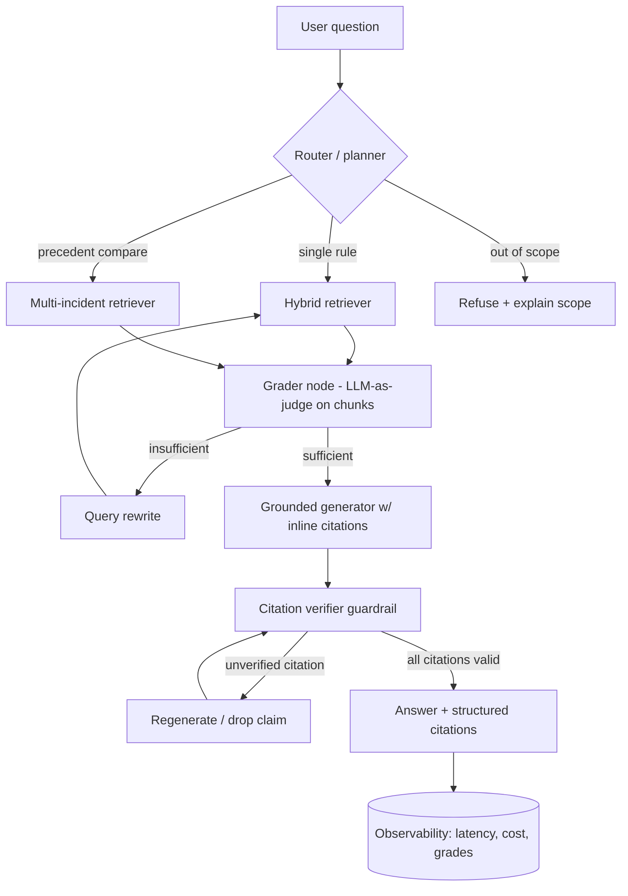

# F1 Rule & Penalty Interpreter — v2 Build Spec

**Goal:** convert the course-project notebook into a deployed, evaluated, agentic RAG system that is genuinely portfolio-grade and makes the resume bullets *true*.

**Gaps closed:** RAG · vector DB (pgvector) · framework (LangGraph) · deployed agent · Docker + CI · guardrails · evaluation depth.

**Honesty guardrails for the resume:**
- This is co-authored coursework. Claim the **v2** (agent + retrieval + eval + infra below) as your own work.
- Do not put `60% → 93%` (or any number) on the resume until *your* eval harness produces it. The harness below generates the real number.

---

## 1. Target architecture



**Layers**
- **Ingestion** → structure-aware PDF parsing of FIA Sporting Regulations + steward decisions.
- **Store** → Postgres + `pgvector`, hybrid dense + sparse retrieval.
- **Agent** → LangGraph state machine (router → retrieve → grade → generate → verify).
- **Guardrails** → input (scope + prompt-injection), output (citation verification, refuse-on-low-coverage).
- **Serving** → FastAPI (streaming) + Next.js (clickable citations).
- **Eval** → golden set + retrieval/generation metrics + ablation grid, gated in CI.
- **Infra** → docker-compose (app + db + frontend), GitHub Actions.

---

## 2. Data & ingestion

**Sources (from your README):** FIA Formula One Sporting Regulations (PDF), FIA steward decision documents (PDF), public penalty summaries.

**Why chunking matters here:** the regs are long, cross-referenced legal text ("see Article 54.4"). Naive fixed-size chunking shatters cross-references — this is the single biggest quality lever and your first ablation axis.

**Strategy — structure-aware, parent-child:**
- Parse with `PyMuPDF` (fast, layout-aware) or `unstructured`. Detect Article boundaries with a regex on the numbering (`^\d+(\.\d+)*`).
- **Parent chunk** = full Article (e.g. all of Article 54). **Child chunks** = sub-articles, embedded individually. Retrieve on children, but pass the **parent** to the generator so cross-references resolve.
- Tag every chunk with metadata: `doc_type`, `article_id`, `season`, `grand_prix`, `document_number`. This metadata is what powers precedent comparison ("similar incident last race").

**Steward decisions** are semi-structured (Document #, Session, Fact, Infringement, Decision, Reason). Parse those fields into columns — they become high-signal retrieval filters.

---

## 3. Vector store — pgvector schema

```sql
CREATE EXTENSION IF NOT EXISTS vector;

CREATE TABLE documents (
    id              BIGSERIAL PRIMARY KEY,
    doc_type        TEXT NOT NULL,          -- 'sporting_regulation' | 'steward_decision'
    source_file     TEXT NOT NULL,
    season          INT,                    -- e.g. 2025
    grand_prix      TEXT,                   -- steward decisions
    document_number TEXT,                   -- steward doc number
    created_at      TIMESTAMPTZ DEFAULT now()
);

CREATE TABLE chunks (
    id              BIGSERIAL PRIMARY KEY,
    document_id     BIGINT REFERENCES documents(id) ON DELETE CASCADE,
    article_id      TEXT,                   -- '54.4' — used for cross-ref + citation checks
    parent_chunk_id BIGINT,                 -- hierarchical parent-child
    content         TEXT NOT NULL,
    token_count     INT,
    embedding       vector(768),            -- BGE-base-en = 768 dims
    tsv             tsvector GENERATED ALWAYS AS (to_tsvector('english', content)) STORED
);

CREATE INDEX ON chunks USING hnsw (embedding vector_cosine_ops);  -- dense
CREATE INDEX ON chunks USING gin  (tsv);                          -- sparse / full-text
CREATE INDEX ON chunks (article_id);
```

**Embeddings:** `BAAI/bge-base-en-v1.5` via `sentence-transformers` (local, free, shows you can run a model). Keep `text-embedding-3-small` as a config-swappable alternative — that swap *is* an ablation row.

---

## 4. Hybrid retrieval (dense + sparse + RRF)

Dense alone misses exact rule numbers; sparse alone misses paraphrases. Fuse them.

```python
def hybrid_retrieve(conn, query_text, query_vec, k=20, rrf_k=60):
    dense = conn.execute("""
        SELECT id, 1 - (embedding <=> %s) AS score
        FROM chunks ORDER BY embedding <=> %s LIMIT %s
    """, (query_vec, query_vec, k)).fetchall()

    sparse = conn.execute("""
        SELECT id, ts_rank(tsv, plainto_tsquery('english', %s)) AS score
        FROM chunks WHERE tsv @@ plainto_tsquery('english', %s)
        ORDER BY score DESC LIMIT %s
    """, (query_text, query_text, k)).fetchall()

    # Reciprocal Rank Fusion
    scores = {}
    for rank, (cid, _) in enumerate(dense):
        scores[cid] = scores.get(cid, 0) + 1 / (rrf_k + rank)
    for rank, (cid, _) in enumerate(sparse):
        scores[cid] = scores.get(cid, 0) + 1 / (rrf_k + rank)
    return sorted(scores, key=scores.get, reverse=True)
```

**Optional rerank:** a cross-encoder (`bge-reranker-base`) over the fused top-20 → top-5. Another ablation row, usually a real quality jump.

---

## 5. Agent — LangGraph

```python
from typing import TypedDict, Literal
from langgraph.graph import StateGraph, END

class State(TypedDict):
    question: str
    route: Literal["single_rule", "precedent", "out_of_scope"]
    docs: list          # retrieved chunks (with parents)
    grade: float        # retrieval sufficiency 0-1
    attempts: int
    answer: str
    citations: list     # [{article_id, doc, snippet}]
    verified: bool

def router(s):     ...  # LLM classifies query type; out_of_scope -> refuse
def retrieve(s):   ...  # hybrid_retrieve, expand children -> parents
def grade(s):      ...  # LLM-as-judge: are these chunks sufficient & relevant? -> grade
def rewrite(s):    ...  # reformulate query, increment attempts
def generate(s):   ...  # grounded answer, inline [Article X.Y] citations only from docs
def verify(s):     ...  # citation guardrail (section 6)

g = StateGraph(State)
for n, f in [("router",router),("retrieve",retrieve),("grade",grade),
             ("rewrite",rewrite),("generate",generate),("verify",verify)]:
    g.add_node(n, f)

g.set_entry_point("router")
g.add_conditional_edges("router", lambda s: s["route"],
    {"single_rule":"retrieve", "precedent":"retrieve", "out_of_scope":END})
g.add_edge("retrieve", "grade")
g.add_conditional_edges("grade",
    lambda s: "generate" if s["grade"] >= 0.7 or s["attempts"] >= 2 else "rewrite",
    {"generate":"generate", "rewrite":"rewrite"})
g.add_edge("rewrite", "retrieve")
g.add_edge("generate", "verify")
g.add_conditional_edges("verify",
    lambda s: END if s["verified"] else "generate",
    {END:END, "generate":"generate"})
app = g.compile()
```

The `grade` node is **LLM-as-judge inside the loop** (corrective RAG). Say that out loud in interviews and connect it to your Louisa confidence-gated judge — same pattern, different domain.

---

## 6. Guardrails (each maps to a risk you listed)

| Your README risk | Guardrail | Mechanism |
|---|---|---|
| Hallucinated rule numbers | **Citation verifier** | Regex `Article \d+(\.\d+)*` from the answer; assert each ∈ `article_id`s of retrieved docs. Unverified → regenerate or drop the claim. |
| Speculation on intent | **Grounded-only system prompt + faithfulness eval** | Generator may only state what's in retrieved text; faithfulness metric catches violations. |
| Incomplete coverage | **Refuse-on-low-coverage** | If `grade < 0.5` after 2 attempts → "I can't find a governing regulation for this" instead of guessing. |
| (Prod awareness) | **Prompt-injection / scope filter** | Incident text is user-supplied; strip instruction-like spans, reject non-F1 queries at the router. |

```python
import re
def verify(state):
    cited = set(re.findall(r"Article\s+(\d+(?:\.\d+)*)", state["answer"]))
    available = {d["article_id"] for d in state["docs"]}
    unverified = cited - available
    state["verified"] = len(unverified) == 0
    state["citations"] = [{"article_id": a, ...} for a in cited & available]
    return state
```

---

## 7. Evaluation harness — the centerpiece

### Golden set (`eval/golden.jsonl`)
Hand-label 50–100 real incidents. This is the work that makes every metric real.

```json
{"id": "2024_austria_lap64", "question": "Why was the Norris–Verstappen collision penalized?",
 "relevant_articles": ["33.4", "54.1"], "category": "precedent",
 "reference_answer": "..."}
```

### Metrics
- **Retrieval:** recall@k, precision@k, nDCG — measured against `relevant_articles`.
- **Citation coverage** *(your headline metric)* = (claims with a valid, verifiable citation) / (total factual claims). Define a "claim" as a sentence asserting a rule/penalty.
- **Citation correctness** = (cited articles ∩ golden relevant) / (cited articles).
- **Faithfulness / answer relevance / context precision:** via **Ragas** (import these; don't reinvent).
- **Refusal correctness:** on a held-out set of unanswerable questions, does it correctly refuse?

Building citation coverage + correctness *yourself* (not just importing Ragas) is what signals depth.

### Ablation grid (generates the real before/after curve)

| Axis | Values |
|---|---|
| Chunking | fixed-512 · structure-aware · parent-child |
| Embeddings | BGE-base · OpenAI-3-small |
| Retrieval | dense · hybrid · hybrid+rerank |
| top-k | 3 · 5 · 10 |

Run the grid, log every cell's metrics, and put the **citation-coverage-vs-config** chart in the README. *That* is your defensible "improved citation coverage from X to Y" line — with the trade-off (recall vs. noise vs. latency) discussed.

---

## 8. Serving

- **FastAPI:** `POST /ask` → streams answer; returns `{answer, citations:[{article_id, doc, snippet}], grade, latency_ms, cost_usd}`.
- **Next.js:** chat UI; render citations as clickable chips that open the cited article text. Matches your existing stack.
- **Streaming:** Server-Sent Events so first token shows fast (report TTFT).

---

## 9. Observability (mirror your ReefScan dashboard)

Log to a Postgres `query_log` table per request: question, route, retrieved ids, grade, attempts, verified, `latency_ms`, `prompt_tokens`, `completion_tokens`, `cost_usd`. A small dashboard page shows p50/p95 latency, cost/query, refusal rate, and grade distribution. Per-query cost tracking lets you reuse your Louisa cost-awareness story.

---

## 10. Infra — Docker + CI

**docker-compose.yml** (app + pgvector + frontend):
```yaml
services:
  db:
    image: pgvector/pgvector:pg16
    environment: { POSTGRES_PASSWORD: postgres, POSTGRES_DB: f1rag }
    volumes: ["pgdata:/var/lib/postgresql/data"]
  api:
    build: ./api
    depends_on: [db]
    environment: { DATABASE_URL: postgresql://postgres:postgres@db:5432/f1rag }
    ports: ["8000:8000"]
  web:
    build: ./web
    depends_on: [api]
    ports: ["3000:3000"]
volumes: { pgdata: {} }
```

**.github/workflows/ci.yml** — the standout MLOps detail (regression-gated evals):
```yaml
name: ci
on: [pull_request]
jobs:
  test-and-eval:
    runs-on: ubuntu-latest
    services:
      db: { image: pgvector/pgvector:pg16, env: { POSTGRES_PASSWORD: postgres }, ports: ["5432:5432"] }
    steps:
      - uses: actions/checkout@v4
      - uses: actions/setup-python@v5
        with: { python-version: "3.11" }
      - run: pip install -r api/requirements.txt
      - run: ruff check . && pytest -q
      - run: python eval/run_eval.py --gate citation_coverage:0.85   # fail build if below
```

---

## 11. Phased plan (be honest about scope — this is ~2 weekends, not 1)

**Weekend 1 — working system (closes 4 gaps):**
1. Ingest + chunk regs/decisions into pgvector (structure-aware).
2. Hybrid retrieval + the LangGraph router→retrieve→grade→generate→verify loop.
3. Citation-verifier + refuse-on-low-coverage guardrails.
4. FastAPI `/ask`; minimal Next.js chat. Dockerize with compose.
→ Unlocks: RAG, vector DB, framework, deployed agent, Docker, guardrails.

**Weekend 2 — make it credible (closes the rest + generates the metric):**
5. Label the 50–100 golden set.
6. Build the eval harness (your citation metrics + Ragas) and run the ablation grid.
7. Put the coverage-vs-config chart + trade-off write-up in the README.
8. GitHub Actions CI with the eval gate. Deploy (DigitalOcean + Vercel).
→ Unlocks: evaluation depth, CI, the real before/after number.

---

## 12. Resume payoff

Once Weekend 2 is done, these become true and defensible:

- *Built an agentic RAG system (LangGraph, pgvector hybrid retrieval) over 1,000+ FIA regulation and steward-decision PDFs that returns rule-grounded, citation-verified explanations for F1 penalties.*
- *Designed an LLM-as-judge grading loop and a citation-verification guardrail that cut unverifiable rule citations to near-zero; raised citation coverage from ⟨X⟩% to ⟨Y⟩% via a chunking × embedding × retrieval ablation.*
- *Shipped with FastAPI/Next.js, Docker Compose, and a GitHub Actions CI gate that fails builds when eval scores regress below threshold.*

**Interview talking points this hands you:** when NOT to use RAG; hybrid vs. dense trade-offs; corrective-RAG / LLM-as-judge in the loop; how you measure a RAG system (the eval section); cost/latency per query (observability); guardrails and failure modes. That list is nearly the entire "what interviewers actually test" section of the field guide.